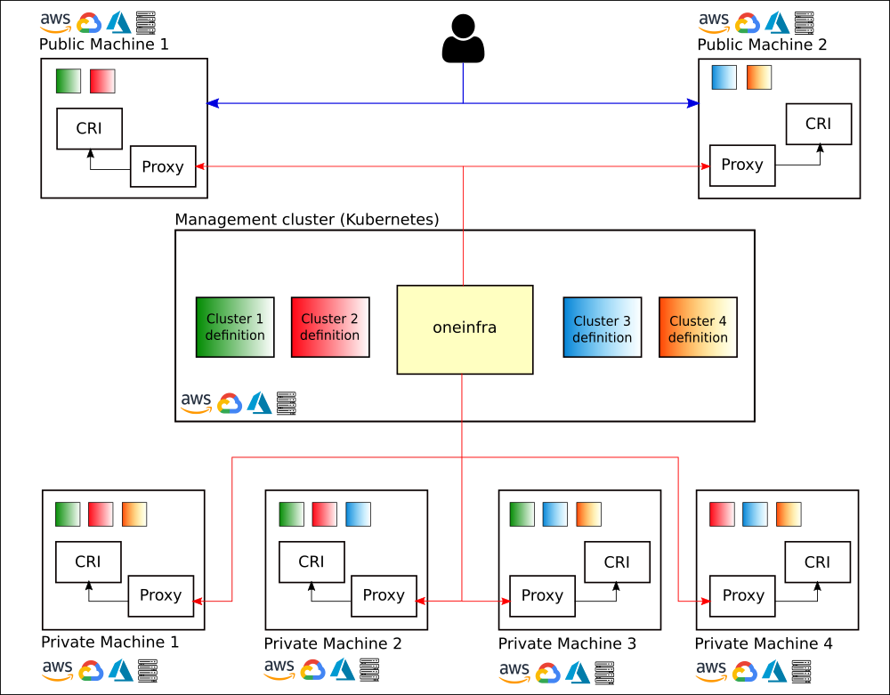

| Go Report                                                                                                                                      | Travis                                                                                                             | CircleCI                                                                                                             | Azure Test                                                                                                                                                                                    | Azure Release                                                                                                                                                                                       | License                                                                                                                              |
|------------------------------------------------------------------------------------------------------------------------------------------------|--------------------------------------------------------------------------------------------------------------------|----------------------------------------------------------------------------------------------------------------------|-----------------------------------------------------------------------------------------------------------------------------------------------------------------------------------------------|-----------------------------------------------------------------------------------------------------------------------------------------------------------------------------------------------------|--------------------------------------------------------------------------------------------------------------------------------------|
| [](https://goreportcard.com/report/github.com/oneinfra/oneinfra) | [](https://travis-ci.org/oneinfra/oneinfra) | [](https://circleci.com/gh/oneinfra/oneinfra) | [](https://dev.azure.com/oneinfra/oneinfra/_build/latest?definitionId=3&branchName=master) | [](https://dev.azure.com/oneinfra/oneinfra/_build/latest?definitionId=4&branchName=master) | [](https://opensource.org/licenses/Apache-2.0)|

# oneinfra

`oneinfra` is a Kubernetes as a Service platform. It empowers you to
provide or consume Kubernetes clusters at scale, on any platform or
service provider. You decide.



You can [read more about its design here](docs/DESIGN.md).


## Managed Kubernetes versions

| Kubernetes version | Deployable with  | Default in       |                                                                                                                                                                            |                                                                                                                                                                             |
|--------------------|------------------|------------------|----------------------------------------------------------------------------------------------------------------------------------------------------------------------------|-----------------------------------------------------------------------------------------------------------------------------------------------------------------------------|
| `1.15.11`          | `20.05.0-alpha10` |                  | %20with%20local%20CRI%20endpoints)        | %20with%20remote%20CRI%20endpoints)        |
| `1.16.9`           | `20.05.0-alpha10` |                  | %20with%20local%20CRI%20endpoints)         | %20with%20remote%20CRI%20endpoints)         |
| `1.17.5`           | `20.05.0-alpha10` |                  | %20with%20local%20CRI%20endpoints)         | %20with%20remote%20CRI%20endpoints)         |
| `1.18.2`           | `20.05.0-alpha10` | `20.05.0-alpha10` | %20with%20local%20CRI%20endpoints)         | %20with%20remote%20CRI%20endpoints)         |
| `1.19.0-alpha.2`   | `20.05.0-alpha10` |                  | %20with%20local%20CRI%20endpoints) | %20with%20remote%20CRI%20endpoints) |


## Install

The `oneinfra` installation has two main binaries, along with a
Kubernetes controller manager (released as a container image).

* `oi`: `oneinfra` main CLI tool.

* `oi-local-hypervisor-set`: allows you to create fake hypervisors
  running as docker containers. **You should never use this command in
  production environments**.

`oi-manager` is `oneinfra`'s Kubernetes controller manager. The
`oi-manager` is released as a container image and published in the
Docker Hub.


### From released binaries

```console
$ wget -O oi https://github.com/oneinfra/oneinfra/releases/download/20.05.0-alpha10/oi-linux-amd64-20.05.0-alpha10
$ chmod +x oi
$ wget -O oi-local-hypervisor-set https://github.com/oneinfra/oneinfra/releases/download/20.05.0-alpha10/oi-local-hypervisor-set-linux-amd64-20.05.0-alpha10
$ chmod +x oi-local-hypervisor-set
```

You can now move these binaries to any place in your `$PATH`, or
execute them with their full path if you prefer.


### From source

Build has been tested with go versions 1.13 and 1.14.

```console
$ GO111MODULE=on go get github.com/oneinfra/oneinfra/...@20.05.0-alpha10
```


## Quick start

For the quick start you can either leverage Kubernetes as a management
cluster, or you can go with the standalone approach if you don't want
to use Kubernetes.

* [Without Kubernetes (for testing purposes
  only)](#without-kubernetes-for-testing-purposes-only)
* [With Kubernetes as a management
  cluster](#with-kubernetes-as-a-management-cluster)


### Without Kubernetes (for testing purposes only)

* Requirements
  * Docker

If you don't want to deploy Kubernetes to test `oneinfra`, you can use
the `oi` CLI tool that will allow you to test the reconciliation
processes of `oneinfra` without the need of a Kubernetes cluster.

```console
$ oi-local-hypervisor-set create | oi cluster inject | oi reconcile > cluster-manifests.conf
```

And access it:

```console
$ cat cluster-manifests.conf | oi cluster admin-kubeconfig > cluster-kubeconfig.conf
$ kubectl --kubeconfig=cluster-kubeconfig.conf cluster-info
Kubernetes master is running at https://172.17.0.3:30000
CoreDNS is running at https://172.17.0.3:30000/api/v1/namespaces/kube-system/services/kube-dns:dns/proxy
```

In this mode it's very important to understand that `oi` will read
manifests from `stdin` and output them into `stdout`, make sure you
keep a file up to date with the latest reconciled resources -- this is
why this model is not suitable for production.


### With Kubernetes as a management cluster

* Requirements
  * A Kubernetes cluster that will be the management cluster
  * The management cluster needs to reach the hypervisors you create
  * Docker, for creating fake local hypervisors

1. [Install
`kind`](https://github.com/kubernetes-sigs/kind#installation-and-usage). If
you already have a Kubernetes cluster you can use, you can skip this
step.

    ```console
    $ kind create cluster
    ```

2. Deploy `cert-manager` and `oneinfra`.

    ```console
    $ kubectl apply --validate=false -f https://github.com/jetstack/cert-manager/releases/download/v0.14.1/cert-manager.yaml
    $ kubectl wait --for=condition=Available deployment --timeout=2m -n cert-manager --all
    $ kubectl apply -f https://raw.githubusercontent.com/oneinfra/oneinfra/20.05.0-alpha10/config/generated/all.yaml
    $ kubectl wait --for=condition=Available deployment --timeout=2m -n oneinfra-system --all
    ```

3. Create a local set of fake hypervisors, so `oneinfra` can schedule
cluster control plane components somewhere. You can [also define your
own set of hypervisors](docs/hypervisors.md) if you prefer.

    ```console
    $ oi-local-hypervisor-set create --tcp | kubectl apply -f -
    ```

    In this case, we need to use the `--tcp` flag, so the `oneinfra`
    controller manager can talk to the CRI endpoints of the fake
    hypervisors.

    Hadn't we provided the `--tcp` flag here, we would have needed to
    mount the UNIX sockets of the different hypervisors inside the
    controller manager, leading to an even more artificial setup.

    In production environments, it is a user responsibility to manage
    the `Hypervisor` resources with remote CRI endpoints.

4. Now, create a [managed cluster](config/samples/simple-cluster.yaml):

    ```console
    $ kubectl apply -f https://raw.githubusercontent.com/oneinfra/oneinfra/20.05.0-alpha10/config/samples/simple-cluster.yaml
    $ kubectl wait --for=condition=ReconcileSucceeded --timeout=2m cluster simple-cluster
    ```

5. And access it:

    ```console
    $ kubectl get cluster simple-cluster -o yaml | oi cluster admin-kubeconfig > simple-cluster-kubeconfig.conf
    $ kubectl --kubeconfig=simple-cluster-kubeconfig.conf cluster-info
    Kubernetes master is running at https://172.17.0.4:30000
    CoreDNS is running at https://172.17.0.4:30000/api/v1/namespaces/kube-system/services/kube-dns:dns/proxy
    ```

6. (optional) You can then create a [second managed
   cluster](config/samples/ha-cluster.yaml), this one comprised by
   three control plane instances:

    ```console
    $ kubectl apply -f https://raw.githubusercontent.com/oneinfra/oneinfra/20.05.0-alpha10/config/samples/ha-cluster.yaml
    $ kubectl wait --for=condition=ReconcileSucceeded --timeout=2m cluster ha-cluster
    ```

    1. And access it:

        ```console
        $ kubectl get cluster ha-cluster -o yaml | oi cluster admin-kubeconfig > ha-cluster-kubeconfig.conf
        $ kubectl --kubeconfig=ha-cluster-kubeconfig.conf cluster-info
        Kubernetes master is running at https://172.17.0.4:30001
        CoreDNS is running at https://172.17.0.4:30001/api/v1/namespaces/kube-system/services/kube-dns:dns/proxy
        ```
7. List clusters and components on the management cluster:

    ```console
    $ kubectl get clusters -A
    NAMESPACE   NAME             KUBERNETES VERSION   API SERVER ENDPOINT        VPN     VPN CIDR   AGE
    default     ha-cluster       1.18.2               https://172.17.0.4:30001   false              3m10s
    default     simple-cluster   1.18.2               https://172.17.0.4:30000   false              6m40s
    ```

    ```console
    $ kubectl get components -A
    NAMESPACE   NAME                                         CLUSTER          ROLE                    HYPERVISOR                  AGE
    default     ha-cluster-control-plane-4v5ft               ha-cluster       control-plane           test-private-hypervisor-0   3m32s
    default     ha-cluster-control-plane-9d9hq               ha-cluster       control-plane           test-private-hypervisor-0   3m32s
    default     ha-cluster-control-plane-ingress-vffm9       ha-cluster       control-plane-ingress   test-public-hypervisor-0    3m32s
    default     ha-cluster-control-plane-md6dv               ha-cluster       control-plane           test-private-hypervisor-0   3m32s
    default     simple-cluster-control-plane-ingress-28wwd   simple-cluster   control-plane-ingress   test-public-hypervisor-0    7m1s
    default     simple-cluster-control-plane-jqwtz           simple-cluster   control-plane           test-private-hypervisor-0   7m1s
    ```

Then play as much as you want by creating new clusters, deleting
existing ones, or anything you want to try. Have fun!


## Defining clusters

You can have a more detailed [read at the documentation on how to
define clusters](docs/clusters.md) once you have set up `oneinfra`.


## Joining worker nodes to a cluster

You can read more details about the [worker joining process
here](docs/joining-worker-nodes.md).


## License

`oneinfra` is licensed under the terms of the Apache 2.0 license.

```
Copyright (C) 2020 Rafael Fernández López <ereslibre@ereslibre.es>

Licensed under the Apache License, Version 2.0 (the "License");
you may not use this file except in compliance with the License.
You may obtain a copy of the License at

   http://www.apache.org/licenses/LICENSE-2.0

Unless required by applicable law or agreed to in writing, software
distributed under the License is distributed on an "AS IS" BASIS,
WITHOUT WARRANTIES OR CONDITIONS OF ANY KIND, either express or implied.
See the License for the specific language governing permissions and
limitations under the License.
```
