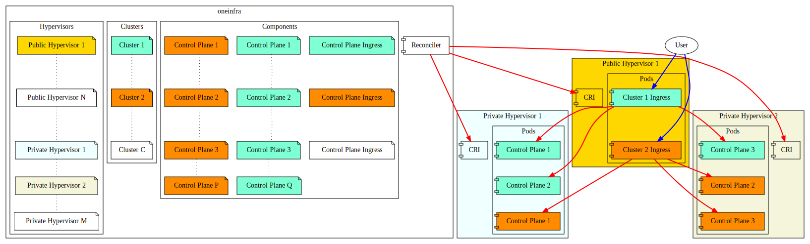

# Goals

`oneinfra`'s goal is to provide a Kubernetes as a Service platform.

It's a managed Kubernetes service, under your control.

It allows you to manage a number of Kubernetes Control Planes in a set
of hypervisors sitting in your infrastructure, on premises or in the
public cloud.

* Easily create isolated Kubernetes control planes
* Manage control planes with a well defined API
* Provide both a CLI and a set of controllers to drive the
  reconciliation process
  * Both CLI and these set of controllers should rely on the same
    API's (custom resources). CLI will read this information from
    within the local FS (or stdin), whereas controllers will read this
    information from resources sitting on your management Kubernetes
    cluster.
* Operating System agnostic
* Edge ready (TODO)
  * Allow to safely join worker nodes, regardless of where they are
    located networking-wise with respect to control plane components
    (e.g. workers behind several NAT levels), or among them
  * CNI overlay will be set on top of the VPN tunnel

# Non-goals

* Create or manage infrastructure in any way
  * `oneinfra` has a hands-off approach of infrastructure. Bring your
    own machines.
* Upgrade clusters
* Perform any kind of worker node management
  * The only exception is the joining process -- it's a oneinfra goal
    to make worker join process as easy and secure as possible

# Components

## Hypervisor

An [hypervisor](hypervisors.md) is a physical or virtual machine where
`oneinfra` will create the control plane components.

Hypervisors are user provided in the form of a CRI endpoint to connect
to.

### Public and private hypervisors

`oneinfra` makes the differentiation between public and private
hypervisors.

#### Public hypervisors

Public hypervisors is where the ingress for the control plane
components will live. This is, a load balancer (or set of load
balancers), and a VPN server per cluster.

Public hypervisors are therefore exposed to the outer world, and
should have an interface inside a public network. They should also
have an interface inside a private network, so they can route traffic
to private hypervisors.

#### Private hypervisors

Private hypervisors is where the control plane components will
run. These private hypervisors should have an interface inside a
private network, only reachable by public hypervisors, and other
private hypervisors.

## Cluster

A [cluster](clusters.md) is the abstraction of a whole Kubernetes
cluster -- with control plane and control plane ingresses. It has all
the certificate authorities and shared information required by the
different components that are part of the same cluster.

## Component

A [component](components.md) represents a schedulable unit. A
component belongs both to a cluster, and to an hypervisor.

Two types of components exist at the moment:

* Control Plane components, formed by:
  * An `etcd` instance
  * An `API server` instance
  * A `Controller Manager` instance
  * A `Scheduler` instance

* Control Plane Ingress, formed by:
  * An `haproxy` instance, pointing to all control plane instances
    that are part of the same cluster.
  * A VPN endpoint.

In the future, it will be possible to scale Control Plane components
in a fine grained way; you will be able to create more `API server`
instances without having to create more `Controller Manager` or
`Scheduler` instances.

# Conceptual architecture diagram

